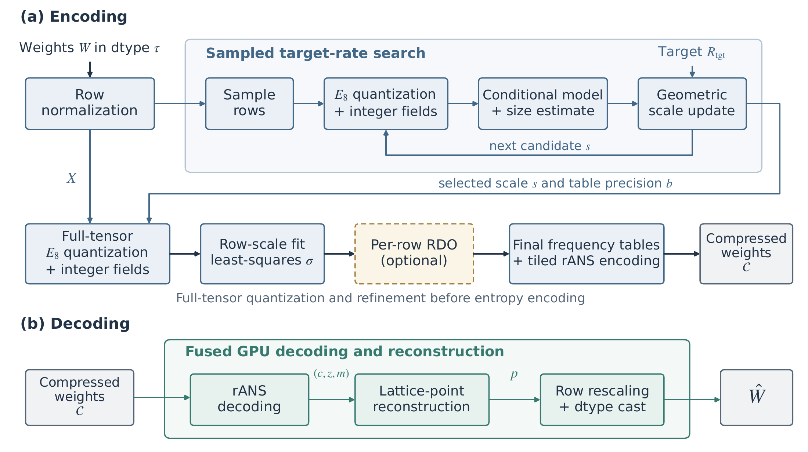

# EntroPack 格量化压缩

EntroPack 的格量化方案结合有损向量量化与无损熵编码，压缩二维张量。
`LatticeRANSConfig` 支持 [0.001, 11] 范围内的有限目标码率，单位为每元素比特数，包括非整数值。
解压后仍保留输入的数据类型，存储码率则通过目标参数调节。



以权重矩阵为例的 EntroPack 编解码流程。上半部分为码率搜索与编码，下半部分为融合 GPU 解码与重建。

## 格量化与整数字段

不同张量行的数值尺度可能相差较大。编码器首先用每行的均方根归一化该行，
再将归一化后的数值每八个组成一个向量。E8 格是八维空间中按规则排列的一组点，
编码器用缩放后的格中最近的点近似每个向量。共享的量化尺度控制格点之间的间距。
间距越小，通常重建误差越小，但描述所选格点需要的比特也越多。

E8 包含整数坐标与半整数坐标两类格点，对应两个陪集。
EntroPack 用陪集标记和八个可逆整数字段表示格点，并利用奇偶约束压缩最后一个坐标的表示。
概率模型根据陪集分别统计各坐标字段的分布，以捕捉两类格点的差异。
频繁出现的字段值平均可用更少的比特表示。解码时，这些字段可通过算术运算还原为格点，无需重建码本。

## 码率选择与精度优化

编码器在采样行上搜索量化尺度，对每个候选尺度估计字段的编码大小及解码所需的元数据，
无需在搜索过程中反复生成完整压缩码流。选定尺度后，再量化整个张量，
并通过最小二乘拟合每行的重建尺度。

可选的逐行率失真优化会为每行比较多个量化精度，在估计的存储预算内分配候选。
这一过程交替进行候选选择和共享概率模型更新，需要额外的编码计算，默认关闭。

## 编码与重建

选定的字段由 rANS 熵编码为可独立解码的 tile。
压缩表示还保存概率表、行尺度和 tile 定位信息。
解码时，GPU 在融合操作中恢复字段、重建格点并应用行尺度，输出与输入形状和 dtype 相同的张量。

重建误差来自量化以及转换回输出 dtype 时的舍入，熵编码本身完整保留选定的字段。
由于尺度搜索使用大小估计，实际码率可能与目标有差别。
`actual_bpp` 按包含元数据的实际存储字节数计算，即字节数乘以八，再除以张量元素数。

## 使用示例

以下示例以每元素 3.5 bit 为目标压缩张量，并以原始张量为参考计算相对 L2 误差。
搜索与精度优化参数见 [Config](../Usage/Configuration.md)。

```python
import torch
import entropack as ep

tensor = (torch.randn(256, 256, device="cuda") * 0.02).to(torch.bfloat16)
config = ep.LatticeRANSConfig(target_bpp=3.5)

compressed = ep.compress(tensor, config)
restored = ep.decompress(compressed, config)

reference = tensor.float()
relative_l2 = (restored.float() - reference).norm() / reference.norm()
assert restored.shape == tensor.shape
assert restored.dtype == tensor.dtype
print(f"Target: {config.target_bpp:.2f} bits per element")
print(f"Stored: {compressed.actual_bpp:.2f} bits per element")
print(f"Relative L2 error: {100 * relative_l2.item():.2f}%")
```
